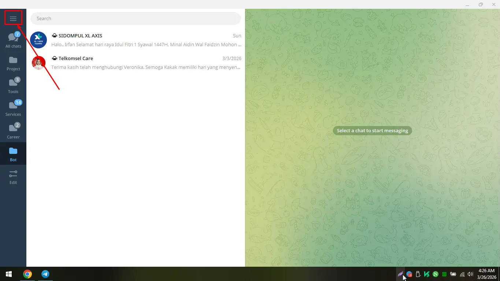

Saat ingin membuka link telegram yang ada dibrowser, saya mengalami kendala

aplikasi telegram tidak mau terbuka atau tidak ter-trigger, padahal intruksi dibrowser sudah dilakukan

solusi sementara yaitu, menyalin linknya lalu saya masukan ke saved message kemudian baru diklik. maka link tg tersebut baru bisa dikunjungi

...

namun cara tersebut ribet sekali, padahal telegram seharusnya bisa mendeteksi linknya

karena saya pakai aplikasi telegram portable, masalah ini muncul dan saya telah menemukan solusinya

berikut cara mengatasi aplikasi telegram yang tidak terbuka melalui link dibrowser

- langkah pertama yaitu buka aplikasi telegram desktopnya terlebih dahulu
- selanjutnya masuk menu pengaturan
- saat sudah dimenu pengaturan, kemudian ketikan ```registertg``` dan selesai
- akan muncul popup dengan pesan 'forced custom scheme register'

setelah melakukan langkah diatas, link tg dari browser sekarang sudah bisa mentrigger aplikasi telegram desktop lagi



...

Sumber: https://github.com/telegramdesktop/tdesktop/issues/29833